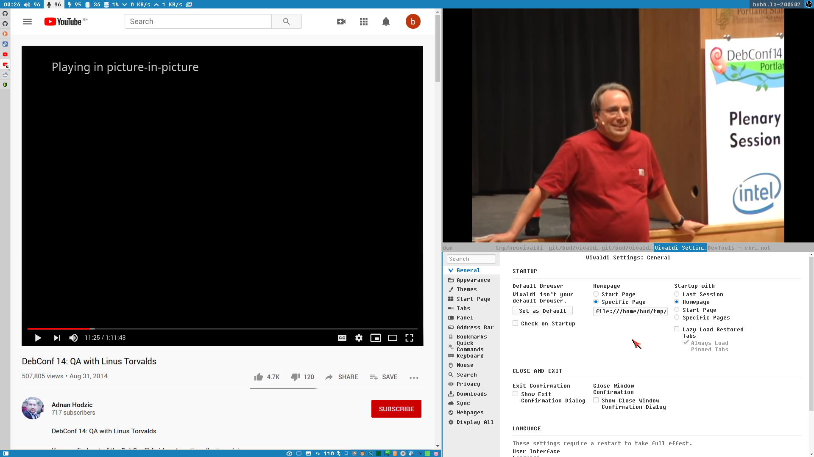

this is my rice:



- vertical tabs
- relies heavily on the extension [vb4c]
- doesn't have a visible adressbar
- maximized vertical space for content
- the main window have a custom window class

Vivaldi is a very *rice friendly* browser and much of the my rice can be achieved from the normal settings, but i also have a bunch of custom scripts and hacks here to achieve the browser experience i want.

[vialdi-launch.sh](./vivaldi-launch.sh) is the script I use to launch/activate the browser. It uses xdotool (or [i3run] if it is installed) to rename the class of the *main window*. The reason I want to do this is that I can easily apply window rules and keybindings from my window manager. I use [i3wm] and by having a one window rule for the main window and another rule for vivaldi windows without a custom class (`Vivaldi-stable`) i get a better tiled experience.  

In the screenshot above the main vivaldi window is to the left and I have just opened the settings window (<key>Ctrl</key>+<key>F12</key>).
The setting window will have the default window class set by Vivaldi, `Vivaldi-stable` and it is automatically placed in the lower right container (**D**), and this is true for any *extra* window that would get created, f.i. **devtools** or **stylish style editor**.

The only thing I have added to my i3 config are the following lines:  

```
bindsym Mod4+f exec --no-startup-id vivaldi-launch

for_window [class=Vivaldi-stable] exec --no-startup-id i3fyra --move D
for_window [class=Vivaldi-main]   exec --no-startup-id i3fyra --move C
for_window [title="Picture in picture"] focus, exec --no-startup-id i3fyra --move B


```

## extension

[vb4c]  
[stylus]  
[violentmonkey]  
[Redirector]  

[i3wm]: https://i3wm.org
[i3run]: https://github.com/budlabs/i3ass/wiki/17AS_i3run
[vb4c]: https://github.com/dcchambers/vb4c
[stylus]: https://github.com/openstyles/stylus
[violentmonkey]: https://violentmonkey.github.io/
[Redirector]: http://einaregilsson.com/redirector/
