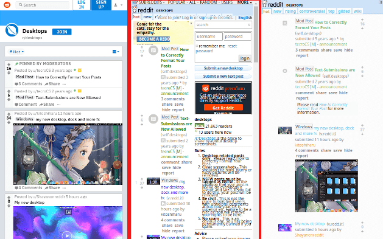

## the ultimate reddit rice

I don't have a reddit account, I think the modern design is slow and bloated and I have a little too much time to waste, this is my reddit rice.  

  

I have tried to make it as modular as possible and separated each *feature* into its own **user.css (_userstyle_)** or **user.js (_userscript_)**. The subdirectories here contain the files and maybe a screenshot, maybe.  

If you have [stylus] and [violentmonkey] installed you can install the files by clicking the links in the table below:  

[stylus]: https://add0n.com/stylus.html
[violentmonkey]: https://violentmonkey.github.io/

| file | function |
|:-----|:---------|
[reddit-theme.user.css] | applies better colors, which are applied from a set of custom properties (*CSS variables*), so they can easily be changed. |

[reddit-theme.user.css]: https://github.com/budRich/vivaldi-ricing/raw/master/reddit/theme/reddit-theme.user.css

## but first, return to the past

For this rice to work ~~correctly~~, one must first make sure that reddit is displayed in it's ~~good~~ old way, and disable any subreddit specific userstyles.  

The *easiest* way to achieve that is to install these two external **userscripts**:  
[reddit old school] - this will redirect any visits to nu-reddit to old.reddit.com, and includes a couple of enhancements (page will scroll to the latest expanded item, and such). It *just werks™*.  

[reddit toggle custom css] lets you toggle between the default CSS and subreddit specific CSS from the (grease|tamper|violent)-monkey menu. (selection is remembered across sessions). 
However the default is to show subreddit specific css, 
but that can be inversed by changing the line:  
`const DISABLE_CSS = false`  
to  
`const DISABLE_CSS = true`  

[reddit old school]: https://greasyfork.org/en/scripts/381544-reddit-old-school/code
[reddit toggle custom css]: https://greasyfork.org/en/scripts/23434-reddit-toggle-custom-css/code

