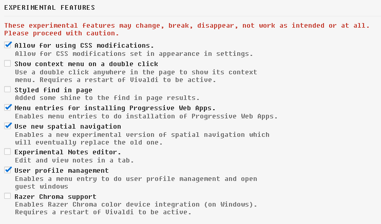
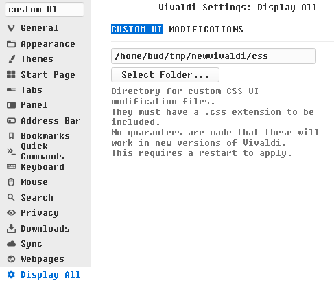

### CSS

to override the CSS for the UI in Vivaldi, one must:

enable the feature on [vivlaldi://experiments](vivlaldi://experiments)  
  

set the directory where the css files are stored in **settings->Appearance->Custom UI Modifications** (*it's easiest to just search for `custom ui`*)  

